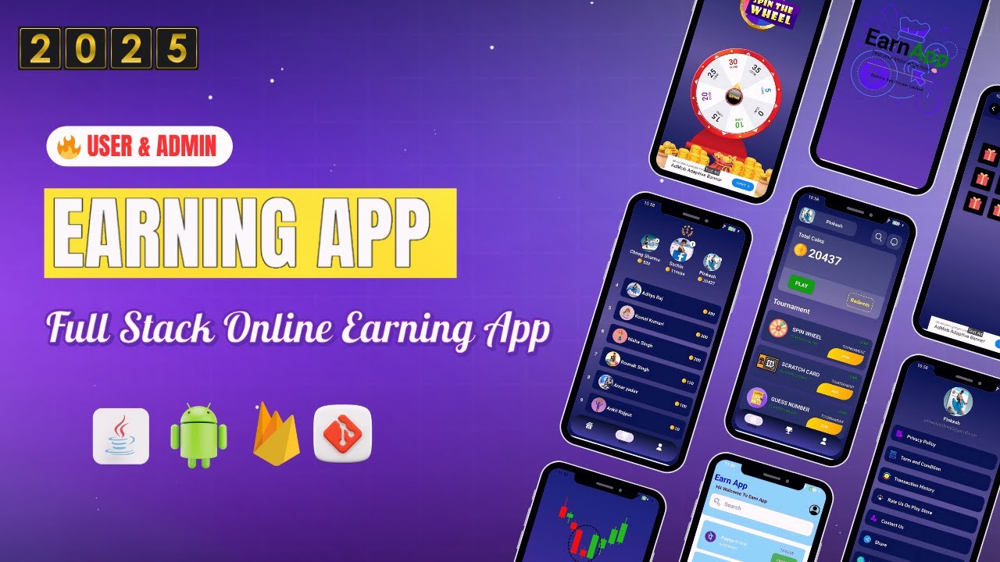

# 💰 Earning App (User + Admin)

A full-featured Earning Android application built using **Java, XML, MVVM Architecture, and Firebase**.

This project demonstrates a reward-based earning system where users can participate in tournaments, earn coins, track rankings, and redeem rewards. The app also includes a powerful admin panel to manage users and system activities.

------------------------------------------------------------

------------------------------------------------------------

Perfect for:
• Resume projects  
• Final year college submissions  
• Hackathons  
• Android portfolio  

------------------------------------------------------------

## 🚀 Features

### 👤 User App

✔ User Sign-up / Login  
✔ Forgot Password functionality  
✔ Spin-to-Win system  
✔ Guess the Number game  
✔ Lucky Draw feature  
✔ Share & earn coins  
✔ Leaderboard ranking system  
✔ View transaction history  
✔ Profile image update  
✔ Coin balance tracking  
✔ Redeem coins to real money  
✔ Secure logout  

------------------------------------------------------------

### 🛠 Admin Panel

✔ Manage users  
✔ Monitor transactions  
✔ Control tournament activities  
✔ Update coin values  
✔ Manage redeem requests  
✔ Configure app settings  
✔ Real-time user activity monitoring  

------------------------------------------------------------

## 🏗 Architecture

• MVVM Architecture  
• Repository Pattern  
• Firebase Authentication  
• Firebase Realtime Database / Firestore  
• ViewModel + LiveData  
• Clean modular structure  
• Scalable Android project design  

------------------------------------------------------------

## 🛠 Tech Stack

• Java  
• XML  
• Android Studio  
• Firebase Authentication  
• Firebase Realtime Database  
• Firebase Firestore  
• Firebase Storage  

------------------------------------------------------------

## 📂 Project Structure

EarningApp/
│
├── data/
├── ui/
├── viewmodel/
├── repository/
├── admin/
└── utils/

------------------------------------------------------------

## 🎯 Tournament System

• Spin-to-Win feature  
• Guess Number game  
• Lucky Draw system  
• Share-to-earn functionality  
• Coin reward distribution  

------------------------------------------------------------

## 🏆 Leaderboard System

• Ranking based on coins earned  
• Real-time leaderboard updates  
• User performance tracking  

------------------------------------------------------------

## 💸 Redeem System

• Convert coins into real money  
• Redeem request handling  
• Admin approval system  

------------------------------------------------------------

## 🧪 How to Run
```bash
1. Clone this repository  
2. Open in Android Studio  
3. Connect Firebase project  
4. Add google-services.json  
5. Sync Gradle  
6. Run on emulator or physical device  
```
------------------------------------------------------------

## 📌 Learning Outcomes

By building this project, you will learn:

• Android development using Java  
• MVVM architecture implementation  
• Firebase integration  
• Real-time data handling  
• Admin + user app architecture  
• Gamification & reward system design  
• Secure redeem logic implementation  

------------------------------------------------------------

## 🤝 Contributing

Contributions are welcome to improve features and performance.

---

## ⭐ Support

If you found this project helpful, please give it a star ⭐

------------------------------------------------------------
